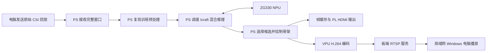

# ADR_00：首版采用 PS 主导的 CSI 回放、混合推理与双路显示架构

- 日期：2026-10-04
- 决策状态：首版方案已获用户批准
- 文档状态：已由用户审查批准，正式归档
- 硬件平台：悟净开发板 Lite，FMQL30TAI/ZG330

## 1. 项目背景与目标

项目最终目标是基于 Wi-Fi CSI 实现能够现场演示的三维人体姿态感知作品，形成数据采集、处理、推理和显示的完整链路。

当前优先证明模型能够在悟净 Lite 上运行并形成系统闭环。首版采用原始 CSI 数据回放，降低实时采集设备、跨接收器同步和新场景数据分布对系统联调的影响。

**回放首版是系统开发基线，不代表实时采集作品或全部比赛开发要求已经完成。**

## 2. 核心架构决策

采用以下数据流：

PS 负责接收、预处理、混合推理调度、候选选择和骨架绘制。NPU 执行编译图中分配给 ZG330 的计算。PL 首版承担配套显示通路；VPU 编码后通过 RTSP 提供第二路输出。

两路输出使用同一份板端计算并绘制的骨架画面，分别转换为显示和编码所需格式，不要求使用相同像素格式或同一物理缓冲区。

## 3. 模型与数据契约

### 3.1 核心模型

首版使用 **2024 版 epoch442** 的已训练模型及现有 ONNX、Icraft ZG330 编译产物，不在首版引入新训练或模型结构修改。

现有编译图包含六个 Host 计算算子：

- TopK ×2
- GatherElements ×1
- Gather ×1
- ScatterND ×2

因此必须验证完整的 **PS/NPU 混合执行链路**，不能将该模型视为全部运行在 NPU 上。

### 3.2 原始输入

每个窗口包含：

| 维度 | 数量 |
| --- | --- |
| 接收器 | 3 |
| 每个接收器的接收天线 | 3 |
| 子载波 | 30 |
| 时间样本 | 20 |

首版输入为已经组织成窗口的原始 CSI 回放。实时采集、跨接收器时间对齐和缺包处理的具体方案留待后续讨论。

电脑仅读取、封装和发送原始 CSI，不生成模型输入或预测结果，也不使用真值参与在线候选选择。

当前窗口格式采用 little-endian float64 I/Q，附带版本、长度、帧号和发送端时间戳。协议细节由软件协议文档维护。

### 3.3 预处理与模型输入

PS 复现原训练代码的：

- 幅度处理；
- 子载波方向的相位展开；
- 三天线相对相位处理；
- 共用线性相位校正；
- 复数重构、相位提取与张量排列。

输出为 float32 `[1,180,60]`：按接收器、天线、时间排列180个 token，每个 token 包含30个幅度和30个校正相位。

首版不增加新的 CSI 滤波、归一化或骨架平滑，以便核对原始部署链路的数值一致性。

## 4. 骨架与双路输出

首版演示单人，从100个候选中选择最高分候选，绘制14关节骨架。

画面采用固定三维斜视角，并显示帧号、候选分数和运行状态。候选分数不作为已经校准的检测置信度，候选排名不作为稳定人物身份；首版不宣称具备人数检测或多人跟踪能力。

模型原始坐标保留，显示变换单独记录，不宣称已经完成物理坐标标定。

输出基线为：

| 输出 | 首版规格 |
| --- | --- |
| HDMI | 720p60，实际兼容性须实屏验证 |
| 网络视频 | 720p、H.264、10帧/秒、RTSP |
| 接收端 | 局域网 Windows 电脑 |
| 备用展示 | 网络骨架展示，仅作为阶段成果或备用演示 |

HDMI 刷新率、编码帧率和骨架有效更新率分别统计，重复显示旧画面不计作新的推理结果。

## 5. 软件与工具分工

板端应用以 C++ 为主体，在现有 **FPAI 容器**中交叉编译。参考现有 Icraft、HDMI、V4L2 和 live555 代码，但必须核对与当前 SDK 及运行位流的配套关系。

工具基线：

| 工具或环境 | 作用 |
| --- | --- |
| Windows Procise | 复旦微 FPGA 综合、实现、位流与下载 |
| Vivado 2019.1／Vivado MCP | 仿真、代码及参考工程辅助 |
| Icraft 3.39.0 | 模型编译与混合推理运行 |
| FPAI 容器 | 板端 C++ 交叉编译 |
| 独立 Conda 验证环境 | 原始样本读取和预处理数值对照 |
| 远程 Ubuntu 训练服务器 | 模型训练，独立于板端部署环境 |

Vivado/Xilinx 的底层原语、IP、约束和位流不能直接替代 Procise 的适配与实板验收。独立流水灯位流也不能替代包含 AI、DDR 和显示通路的系统位流。

## 6. 实施顺序与停止条件

1. **核对系统配套**  
   确认实际启动的 BOOT、位流、设备树和 AI/HDMI 接口。配套不明确时暂停相关设备访问，不使用未经确认的寄存器地址或自行替换启动组件。

2. **验证预处理与混合推理**  
   使用固定原始 CSI 样本，比对训练预处理、ONNX、Icraft参考执行和板端混合推理。报告误差并讨论验收容限，不以“屏幕出现骨架”代替数值验证。

3. **分别验证输出，再合并**  
   先用测试画面验证 HDMI、编码和 RTSP，再接入真实板端推理画面。参考代码存在不等于功能已经通过。

4. **验证连续运行与性能**  
   接收、推理和输出分开调度，限制队列长度。过载时丢弃过期完整窗口并计数，避免延迟持续累积；异常或输入中断时明确显示状态。

启动配置、依赖安装、模型修正或新增 FPGA 工程，均须先提出具体方案并取得用户同意。

## 7. 首版验收标准

- 板端预处理与参考实现一致，误差容限经讨论确认。
- 完整混合推理结果有限、随输入有效变化，并通过数值核验。
- HDMI 和 RTSP 同时显示板端实际计算的骨架，帧号可追溯。
- 骨架有效更新率至少 **5Hz**，**10Hz**为优化目标。
- 从完整 CSI 窗口到达板端至画面完成，延迟 **P95≤500ms**。
- RTSP 电脑呈现延迟另行测量，不直接使用未经同步的跨设备时间戳计算。
- 连续运行30分钟，并验证输入中断、客户端重连、过载和异常数据处理。
- 保存工具版本、模型及源码哈希、阶段耗时、丢帧和错误记录。

**NPU 与双路输出均通过才算完整首版。** 全CPU推理、电脑推理或预制预测视频不能替代正式验收。

## 8. 选择依据与代价

PS 优先能降低首版的数值移植、硬件接口和系统集成复杂度，也便于定位各阶段耗时。现有模型包含 Host 算子，PS 调度本身就是部署链路的一部分。

该方案仍可能受到 PS 计算、内存搬运、混合推理切换和绘图开销限制，能否达到性能目标必须实测。

暂缓全面 PL 预处理和算子加速，可以先建立可比较的软件基线；代价是首版尚不能证明 PL 加速收益，也未落实全部比赛 FPGA 开发内容。

选择回放便于复现与定位问题；代价是首版不验证实时采集、同步或新硬件、新场景下的模型有效性。

## 9. 后续扩展原则

首版完成后，根据阶段耗时、CPU负载、搬运开销和资源预算，讨论值得迁入 PL 的功能，并分别验证数值一致性与性能收益。

实时采集按以下顺序推进：

**单接收器验证 → 三接收器扩展 → 数据对齐 → 预处理与模型适配验证。**

更换采集硬件可能改变数据分布，不能仅凭张量形状相同认定现有权重可以直接使用。

## 10. 当前状态快照

截至2026-10-04，已完成独立 C++ 预处理、交叉编译、实板数值测试和回放发送端测试，**完整首版尚未实现或验收**。

三份真实 CSI 的 float32 输入张量在主机及 Lite 上与当前参考逐位一致，板端单次预处理约5.70–5.78ms。该结果不包含推理、绘图或编码，不能证明端到端性能达标。

归档时仍有两个阻断项（历史状态，最新更新见第12节）：

- 实际运行的 AI/HDMI 位流身份与接口配套尚未确认。
- ±π 合成边界存在较大数值差异，总体预处理门检尚未通过。

本 ADR 记录已讨论的架构，不预先确定上述阻断项的解决方案。详细实施状态和证据分别由阶段报告、REFERENCES.md 和 Done.md维护。

## 11. 关联资料

- [资料与首版阶段记录](../REFERENCES.md)
- [软件说明及协议入口](../software/pose_v1/README.md)
- [当前实施状态与证据](../tools/pose-v1/STATUS.md)

## 12. 2026-10-04：启动配套与预处理验收更新

用户批准以真实回放作为首版预处理门检，人工±π边界保留为非阻断诊断，不宣称这些边界已通过。
固定选择9组共300份测试集CSI，包含原3份回归样本；组名排序前三组各34份，其余各33份，
组内按原列表均匀选取，保存清单及哈希。幅度比较atol=1e-6/rtol=1e-6；相位周期误差最大≤1e-5 rad。
原始张量绝对差、逐位一致性仍保留；真实样本相位绝对差>1e-5 rad时须讨论模型输入影响。

此次300份真实输入在Linux主机及Lite上均与Windows参考逐位一致，幅度、原始相位绝对差和周期误差均为0，
预处理门检通过。四类非法记录均拒绝。人工±π的周期最大误差仍为2.333111/2.693437 rad，诊断失败记录保留。
原预处理算法、模型和ARM二进制未修改。当前门检只覆盖现有回放数据，不代表任意输入或未来实时采集已验收。

用户更换的BOOT与指定Lite 25122301包哈希相同，其他8个启动分区文件未变。FSBL日志确认BOOT内PL下载成功，
后续uEnv文件系统错误不作为download.bit加载成功，也不否定先前FSBL加载。
从日志给出的分区位置解析BOOT，转换32位字节序后，完整.bit配置载荷与分区对应内容相同，
分区另有4字节尾随数据。随后经用户单独批准的最小只读探测回读FPGA版本`0x25122301`，运行版本身份已核验。

板端Icraft/CustomOp实测为arm64 3.39.0；参考包标3.36.0，SDK混合推理兼容性仍待运行验证。
HDMI参考默认1080p60，其缓存包装器没有配置720p时序；720p60目标保持，实际时序与实屏验收待核对。
用户确认屏幕尚未连接。尚未初始化SDK设备、运行模型或访问DMA/HDMI/VPU，完整首版仍未完成。
最新结果见[阶段报告](../tools/pose-v1/RESULTS-300.md)，后续讨论范围见[NEXT-GATE.md](../tools/pose-v1/NEXT-GATE.md)。
