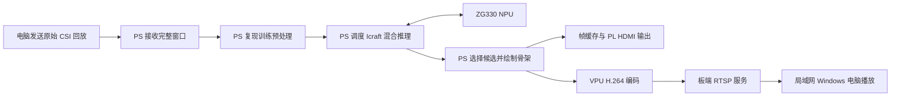

# ADR_00：首版采用 PS 主导的 CSI 回放、混合推理与双路显示架构

2026-10-07最新：用户已审查独立H264样片，允许HDMI测试，撤销下述暂停。HDMI1080p60目标保持；下一按[视频计划](../tools/pose-v1/NEXT-VIDEO-PLAN-20261007.md)先建立当前BOOT时钟/scanout/换帧配套，再独立测试。不将恢复授权写成实际时序已经切换。

2026-10-07用户补充：DELL E2421HN接入Lite后报告“不支持当前输入时序”。后续HDMI目标改为**1920×1080、60Hz**，同时暂停HDMI设备测试，先独立H.264编码及主机视频审查。这替代下文720p60显示目标，下文原选择保留为历史依据。当前仅更新目标，尚未修改板端时序、像素时钟、BOOT或位流；附件是PC端1080p60设置，不是板端实际时序证明。独立H.264测试沿用已验证720p CPU画面、10fps，与HDMI扫描时序分别管理。

- 日期：2026-10-04
- 决策状态：首版方案已获用户批准
- 文档状态：已由用户审查批准，正式归档
- 硬件平台：悟净开发板 Lite，FMQL30TAI/ZG330

2026-10-07补充决策：[ADR_01](ADR_01.md)确认以已验证lazy-r4异构方案先完成首版全流程，深度零拷贝/图/算子优化后置；本文件整体架构与首版验收目标保持。

## 1. 项目背景与目标

项目最终目标是基于 Wi-Fi CSI 实现能够现场演示的三维人体姿态感知作品，形成数据采集、处理、推理和显示的完整链路。

当前优先证明模型能够在悟净 Lite 上运行并形成系统闭环。首版采用原始 CSI 数据回放，降低实时采集设备、跨接收器同步和新场景数据分布对系统联调的影响。

**回放首版是系统开发基线，不代表实时采集作品或全部比赛开发要求已经完成。**

## 2. 核心架构决策

采用以下数据流：

PS 负责接收、预处理、混合推理调度、候选选择和骨架绘制。NPU 执行编译图中分配给 ZG330 的计算。PL 首版承担配套显示通路；VPU 编码后通过 RTSP 提供第二路输出。

两路输出使用同一份板端计算并绘制的骨架画面，分别转换为显示和编码所需格式，不要求使用相同像素格式或同一物理缓冲区。

## 3. 模型与数据契约

### 3.1 核心模型

首版使用 **2024 版 epoch442** 的已训练模型及现有 ONNX、Icraft ZG330 编译产物，不在首版引入新训练或模型结构修改。

现有编译图包含六个 Host 计算算子：

- TopK ×2
- GatherElements ×1
- Gather ×1
- ScatterND ×2

因此必须验证完整的 **PS/NPU 混合执行链路**，不能将该模型视为全部运行在 NPU 上。

### 3.2 原始输入

每个窗口包含：

| 维度 | 数量 |
| --- | --- |
| 接收器 | 3 |
| 每个接收器的接收天线 | 3 |
| 子载波 | 30 |
| 时间样本 | 20 |

首版输入为已经组织成窗口的原始 CSI 回放。实时采集、跨接收器时间对齐和缺包处理的具体方案留待后续讨论。

电脑仅读取、封装和发送原始 CSI，不生成模型输入或预测结果，也不使用真值参与在线候选选择。

当前窗口格式采用 little-endian float64 I/Q，附带版本、长度、帧号和发送端时间戳。协议细节由软件协议文档维护。

### 3.3 预处理与模型输入

PS 复现原训练代码的：

- 幅度处理；
- 子载波方向的相位展开；
- 三天线相对相位处理；
- 共用线性相位校正；
- 复数重构、相位提取与张量排列。

输出为 float32 `[1,180,60]`：按接收器、天线、时间排列180个 token，每个 token 包含30个幅度和30个校正相位。

首版不增加新的 CSI 滤波、归一化或骨架平滑，以便核对原始部署链路的数值一致性。

## 4. 骨架与双路输出

首版演示单人，从100个候选中选择最高分候选，绘制14关节骨架。

画面采用固定三维斜视角，并显示帧号、候选分数和运行状态。候选分数不作为已经校准的检测置信度，候选排名不作为稳定人物身份；首版不宣称具备人数检测或多人跟踪能力。

模型原始坐标保留，显示变换单独记录，不宣称已经完成物理坐标标定。

输出基线为：

| 输出 | 首版规格 |
| --- | --- |
| HDMI | 720p60，实际兼容性须实屏验证 |
| 网络视频 | 720p、H.264、10帧/秒、RTSP |
| 接收端 | 局域网 Windows 电脑 |
| 备用展示 | 网络骨架展示，仅作为阶段成果或备用演示 |

HDMI 刷新率、编码帧率和骨架有效更新率分别统计，重复显示旧画面不计作新的推理结果。

## 5. 软件与工具分工

板端应用以 C++ 为主体，在现有 **FPAI 容器**中交叉编译。参考现有 Icraft、HDMI、V4L2 和 live555 代码，但必须核对与当前 SDK 及运行位流的配套关系。

工具基线：

| 工具或环境 | 作用 |
| --- | --- |
| Windows Procise | 复旦微 FPGA 综合、实现、位流与下载 |
| Vivado 2019.1／Vivado MCP | 仿真、代码及参考工程辅助 |
| Icraft 3.39.0 | 模型编译与混合推理运行 |
| FPAI 容器 | 板端 C++ 交叉编译 |
| 独立 Conda 验证环境 | 原始样本读取和预处理数值对照 |
| 远程 Ubuntu 训练服务器 | 模型训练，独立于板端部署环境 |

Vivado/Xilinx 的底层原语、IP、约束和位流不能直接替代 Procise 的适配与实板验收。独立流水灯位流也不能替代包含 AI、DDR 和显示通路的系统位流。

## 6. 实施顺序与停止条件

1. **核对系统配套**  
   确认实际启动的 BOOT、位流、设备树和 AI/HDMI 接口。配套不明确时暂停相关设备访问，不使用未经确认的寄存器地址或自行替换启动组件。

2. **验证预处理与混合推理**  
   使用固定原始 CSI 样本，比对训练预处理、ONNX、Icraft参考执行和板端混合推理。报告误差并讨论验收容限，不以“屏幕出现骨架”代替数值验证。

3. **分别验证输出，再合并**  
   先用测试画面验证 HDMI、编码和 RTSP，再接入真实板端推理画面。参考代码存在不等于功能已经通过。

4. **验证连续运行与性能**  
   接收、推理和输出分开调度，限制队列长度。过载时丢弃过期完整窗口并计数，避免延迟持续累积；异常或输入中断时明确显示状态。

启动配置、依赖安装、模型修正或新增 FPGA 工程，均须先提出具体方案并取得用户同意。

## 7. 首版验收标准

- 板端预处理与参考实现一致，误差容限经讨论确认。
- 完整混合推理结果有限、随输入有效变化，并通过数值核验。
- HDMI 和 RTSP 同时显示板端实际计算的骨架，帧号可追溯。
- 骨架有效更新率至少 **5Hz**，**10Hz**为优化目标。
- 从完整 CSI 窗口到达板端至画面完成，延迟 **P95≤500ms**。
- RTSP 电脑呈现延迟另行测量，不直接使用未经同步的跨设备时间戳计算。
- 连续运行30分钟，并验证输入中断、客户端重连、过载和异常数据处理。
- 保存工具版本、模型及源码哈希、阶段耗时、丢帧和错误记录。

**NPU 与双路输出均通过才算完整首版。** 全CPU推理、电脑推理或预制预测视频不能替代正式验收。

## 8. 选择依据与代价

PS 优先能降低首版的数值移植、硬件接口和系统集成复杂度，也便于定位各阶段耗时。现有模型包含 Host 算子，PS 调度本身就是部署链路的一部分。

该方案仍可能受到 PS 计算、内存搬运、混合推理切换和绘图开销限制，能否达到性能目标必须实测。

暂缓全面 PL 预处理和算子加速，可以先建立可比较的软件基线；代价是首版尚不能证明 PL 加速收益，也未落实全部比赛 FPGA 开发内容。

选择回放便于复现与定位问题；代价是首版不验证实时采集、同步或新硬件、新场景下的模型有效性。

## 9. 后续扩展原则

首版完成后，根据阶段耗时、CPU负载、搬运开销和资源预算，讨论值得迁入 PL 的功能，并分别验证数值一致性与性能收益。

实时采集按以下顺序推进：

**单接收器验证 → 三接收器扩展 → 数据对齐 → 预处理与模型适配验证。**

更换采集硬件可能改变数据分布，不能仅凭张量形状相同认定现有权重可以直接使用。

## 10. 当前状态快照

截至2026-10-04，已完成独立 C++ 预处理、交叉编译、实板数值测试和回放发送端测试，**完整首版尚未实现或验收**。

三份真实 CSI 的 float32 输入张量在主机及 Lite 上与当前参考逐位一致，板端单次预处理约5.70–5.78ms。该结果不包含推理、绘图或编码，不能证明端到端性能达标。

归档时仍有两个阻断项（历史状态，最新更新见第12节）：

- 实际运行的 AI/HDMI 位流身份与接口配套尚未确认。
- ±π 合成边界存在较大数值差异，总体预处理门检尚未通过。

本 ADR 记录已讨论的架构，不预先确定上述阻断项的解决方案。详细实施状态和证据分别由阶段报告、REFERENCES.md 和 Done.md维护。

## 11. 关联资料

- [资料与首版阶段记录](../REFERENCES.md)
- [软件说明及协议入口](../software/pose_v1/README.md)
- [当前实施状态与证据](../tools/pose-v1/STATUS.md)

## 12. 2026-10-04：启动配套与预处理验收更新

用户批准以真实回放作为首版预处理门检，人工±π边界保留为非阻断诊断，不宣称这些边界已通过。
固定选择9组共300份测试集CSI，包含原3份回归样本；组名排序前三组各34份，其余各33份，
组内按原列表均匀选取，保存清单及哈希。幅度比较atol=1e-6/rtol=1e-6；相位周期误差最大≤1e-5 rad。
原始张量绝对差、逐位一致性仍保留；真实样本相位绝对差>1e-5 rad时须讨论模型输入影响。

此次300份真实输入在Linux主机及Lite上均与Windows参考逐位一致，幅度、原始相位绝对差和周期误差均为0，
预处理门检通过。四类非法记录均拒绝。人工±π的周期最大误差仍为2.333111/2.693437 rad，诊断失败记录保留。
原预处理算法、模型和ARM二进制未修改。当前门检只覆盖现有回放数据，不代表任意输入或未来实时采集已验收。

用户更换的BOOT与指定Lite 25122301包哈希相同，其他8个启动分区文件未变。FSBL日志确认BOOT内PL下载成功，
后续uEnv文件系统错误不作为download.bit加载成功，也不否定先前FSBL加载。
从日志给出的分区位置解析BOOT，转换32位字节序后，完整.bit配置载荷与分区对应内容相同，
分区另有4字节尾随数据。随后经用户单独批准的最小只读探测回读FPGA版本`0x25122301`，运行版本身份已核验。

板端Icraft/CustomOp实测为arm64 3.39.0；参考包标3.36.0，SDK混合推理兼容性仍待运行验证。
HDMI参考默认1080p60，其缓存包装器没有配置720p时序；720p60目标保持，实际时序与实屏验收待核对。
用户确认屏幕尚未连接。尚未初始化SDK设备、运行模型或访问DMA/HDMI/VPU，完整首版仍未完成。
最新结果见[阶段报告](../tools/pose-v1/RESULTS-300.md)，后续讨论范围见[NEXT-GATE.md](../tools/pose-v1/NEXT-GATE.md)。

## 13. 2026-10-05：下一阶段实施与执行分工

用户同意优先准备2024 epoch442独立混合推理门检，并静态核对HDMI配套；模型与首版目标保持不变。
原三份真实样本来自已通过的300份固定清单，ONNX与Icraft Host使用同一参考输入，
Lite从同一原始CSI在PS预处理后执行ZG330＋六个Host算子，保存完整候选及后端执行/耗时证据。
分数与坐标误差容限依实测另行讨论，不自动修改模型或以CPU参考替代NPU。

本轮完成源码和命令准备，未编译、测试、初始化设备或执行模型。
软件/AI实际操作由用户完成，代理编写、审查程序和分析结果；FPGA仿真/实现/下载由代理执行，仍遵循审批规则。
先查询SDK/编译工具/依赖，再编译并离线检查，单独probe结果复核后继续混合推理。
新依赖、启动配置、模型或FPGA工程变更不包括在此次实施中。

HDMI审查发现参考RTL可写时序项，但对应当前25122301位流及像素时钟的证据不足，
未配置寄存器或改为1080p，720p60目标保持。执行入口见
[INFERENCE-COMMANDS.md](../tools/pose-v1/INFERENCE-COMMANDS.md)；静态证据见
[HDMI-STATIC-AUDIT.md](../tools/pose-v1/HDMI-STATIC-AUDIT.md)。

2026-10-05执行状态补充（不改变上述架构）：用户完成固定三样本打包及FPAI GCC9.4.0/CMake3.24.2交叉编译，
板端包11项哈希通过、动态库已列出依赖均解析，ZG JSON离线接口/阶段检查通过。
用户随后完成SDK Device::Open/version探测，退出码0、初始化成功、阶段完整、stderr为空、无失败记录，
device=25122301、icore=FMSHZGV3TECH-AID - 24160628；提供的内核尾部未见探测相关总线/DMA错误。
该通过范围不包含RAW参数加载、模型执行、六个Host算子与NPU计算或数值/性能验收。
compatibility_passed=false固定待验收标记保持；ONNX Runtime依赖缺失、Windows Host编译工具待确认，
参考结果有效前不推进mixed。HDMI720p60、RTSP及完整闭环仍未验收，软件实际操作继续由用户执行。
最新证据与命令见[阶段状态](../tools/pose-v1/STATUS.md)和[执行说明](../tools/pose-v1/INFERENCE-COMMANDS.md)。

同日参考执行位置更新：用户在原开发CMD已验证MSVC x64/CMake3.31.6-msvc6可用，但Windows SDK未识别。
用户明确同意本阶段先以Lite Host作为F2参考，复用现有AArch64检查器、optimized模型及三个固定参考张量。
先资源查询，再运行一次受300秒限制的Host参考，保存完整候选/输入/后端/日志及哈希。
这只调整数值参考的位置，不改变正式PS/NPU与双路目标；ARM支持/内存/数值仍待验证，CPU参考不能替代NPU验收。
Windows Host路线保留，ORT依赖解析/安装仍需独立批准，未执行Host或mixed模型。
具体范围[REFERENCE-NEXT-PLAN.md](../tools/pose-v1/REFERENCE-NEXT-PLAN.md)，
用户命令[LITE-HOST-COMMANDS.md](../tools/pose-v1/LITE-HOST-COMMANDS.md)。

## 14. 2026-10-06：CPU验收后接入候选、工程与数值分阶段

用户批准“进度归档、ONNX参考与PS/NPU混合推理验证”方案，更新第13节后续路径。
CPU独立候选107例/12注册/22输出59,600 FP32已验收，但Host CPTR测试不能证明真实NPU数据交接。
Icraft全CPU optimized op1 Matmul未注册仍为事实；正式ZG图Matmul仍分配NPU。

决定以ONNX完整模型直接对照板端，工程和数值分阶段，不等待Icraft全CPU Matmul打通。
代理自行创建独立Conda并安装CPU ORT1.23.2、运行本机三样本参考；FPAI构建、传输和Lite阶段由用户执行。
依赖解析实际锁定，DLL/版本冲突、源码构建则停。原环境/模型/权重/BOOT及原推理器保留。
当前新环境Python3.10.21/NumPy2.2.5/ORT1.23.2及三样本参考已通过接口/有限性/重复性，
新mixed候选尚未编译/板测；此处记录决定及实施状态，不声称NPU或部署精度通过。

独立pose_mixed_check复用已验证CPU接口，仅注册三类缺失节点；Gather保持，不补CPU Matmul。
桥先等待输入ready、用SDK复制至Host CPTR暂存、计算后SDK写回完整输出缓冲区；ADDR/BOTH不直接解引用。
只接受当前FP32/布局/全有效分布和明确设备区域；真实RAW参数核对，不替换模型参数。
Linux cache helper不是同步证明，真实NPU/CPU交接须工程阶段实测。

顺序：构建身份→107例Host桥回归→离线图/RAW/PS输入→30秒SDK两16KiB往返→300秒Session apply不前向
→180秒308→300秒三样本；每阶段证据核验后继续，硬件显式allow-device-init。
保存1173HardOp与六Host绑定、实际后端回调、内存/搬运/耗时/失败位置；未明融合映射停止讨论。
超时/OOM/总线/SDK异常、非有限、身份变化或全输出不变则保存停止，无自动重试/复位/改模型。

完整分数/姿态报告绝对误差最大/平均/RMS/P95、逐位一致、最高分槽位切换及最佳候选姿态差异；
同槽位不代表同候选身份，原始单位不作物理标定/MPJPE，容限根据实测另行讨论。
ONNX失败只暂停数值比较，工程按阶段可独立推进。HDMI/RTSP/5Hz/延迟/30分钟闭环不属于本轮验收。
入口[新命令](../tools/pose-v1/MIXED-VALIDATION-COMMANDS.md)、[范围](../tools/pose-v1/MIXED-VALIDATION.md)，
实测[ONNX参考](../tools/pose-v1/ONNX-REFERENCE-RESULTS-20261006.md)；历史Host失败和审批快照保留。

同日构建门检补充：用户完成mixed-20261006-r1，代理直接核对源码/ARM SDK/模型包和AArch64 PIE身份通过；
唯一缩进warning为JSON输出多语句同一行，控制流符合预期，源码/包保持不变，无需因该警告重编译。
build.acceptance.json已生成，按既定顺序由用户传板后先Host桥回归；未执行新板端阶段，不扩大为mixed通过。

同日Host桥回归验收补充：用户执行并完整回传，107例/12注册/22输出59,600FP32逐位一致、全有限，
回传45项及程序/SDK身份匹配；全部暂存搬运源/目标均Host CPTR。host-check.acceptance.json已生成，
真实RAW/设备内存/Session/NPU仍待后续阶段，未改架构或原模型。提前offline因缺前阶段验收停在预检，失败目录保留回传再处理。
完整[Host结果](../tools/pose-v1/MIXED-HOST-RESULTS-20261006.md)。

同日正式离线验收补充：四真实RAW参数物化/范围合法，三份PS输入与固定及ONNX逐位一致，
注册/32回传哈希/SDK身份/阶段核验通过。offline-check.acceptance.json已生成；无设备初始化/完整Session/前向。
下一步保持原批准顺序，仅SDK两16KiB内存往返，用户确认BOOT/JTAG未变且无并发访问后执行，结果先核验再apply。
结果[MIXED-OFFLINE-RESULTS-20261006.md](../tools/pose-v1/MIXED-OFFLINE-RESULTS-20261006.md)，未更改模型或架构。

同日SDK内存阶段验收补充：用户Device::Open及两16KiB ADDR PLDDR缓冲区往返通过，版本25122301/icore24160628保持，
六份24,576FP32模式含-0/+0逐位一致、28回传及SDK/程序身份匹配、内核前后相同；memory-check.acceptance.json已生成。
仅SDK CPU↔设备copyFrom路径验收，未模型Session/前向/NPU生产者同步。按既定顺序下一步用户仅300秒apply-check并回传。
结果[MIXED-MEMORY-RESULTS-20261006.md](../tools/pose-v1/MIXED-MEMORY-RESULTS-20261006.md)，未改方案/SDK/配置。

## 15. 2026-10-06：apply失败后的绑定快照取证

apply-r1已到session_applied，随后首个原HardOp8622缺预期绑定追溯，退出1，无模型forward。
SDK提供autoMerge及HardOpInfo.merge_from，但已有日志仅绑定首行，实际映射未知；不直接放宽或改SDK默认优化。
用户明确批准仅增加快照：Session创建后/apply后全量绑定键、原图/Session/后端视图、ZG hardop_map/merge_from/net_hardop/同步索引。
已按审阅候选逐字节应用，保留旧源码/r1程序/包/失败目录；严格1173HardOp及六Host要求、数学/数据桥/前向保持。
新package-20261006-binding-r2已准备并静态核验，尚未交叉编译/板测。
用户新构建后先新身份Host107、离线、SDK内存门禁，再一次300秒apply取证，不执行mixed或另行autoMerge。
原检查可能仍退出1，先完整回传分析；正式融合覆盖方案必须依据实际快照另行审阅，不自动宣称部署通过。
执行入口[MIXED-BINDING-R2-COMMANDS.md](../tools/pose-v1/MIXED-BINDING-R2-COMMANDS.md)，
方案[MIXED-BINDING-SNAPSHOT-PLAN.md](../tools/pose-v1/MIXED-BINDING-SNAPSHOT-PLAN.md)。

同日r2构建验收更新：用户GCC9.4/CMake3.24.2完成新程序，10源码/15ARM头文件/Host＋ZG库/包及程序身份匹配，
与审阅候选一致；新AArch64 PIE SHA25694a03a90…bd061248，只有原已审查的缩进warning。
build.acceptance.json已生成，公共字段可编译不代表实际快照/融合覆盖通过；用户继续新目录传输后先Host回归。
结果[MIXED-BINDING-R2-BUILD-RESULTS.md](../tools/pose-v1/MIXED-BINDING-R2-BUILD-RESULTS.md)，新运行阶段尚未执行。

## 16. 2026-10-06：跨帧执行状态协议与r6工程验收

用户明确将当前问题全部执行交给代理。r4内容证明caller/Input0更新和CPU计算正确；r5公共SDK状态取证显示执行计数跨帧累加，旧计数错误满足本帧完成阈值。
依据匹配ARM实现及官方reset等级表，仅在安全帧边界使用Device::reset(1)清FPGA状态并验证0，完成输出waitForReady及固定745后才下一帧。
同一Session/1173七组/六计算Host、模型/RAW、SDK和BOOT保持，Matmul仍NPU；未使用全复位、缓存清理、每帧Session重建或直接寄存器写。
r6构建、Host107、离线、内存、apply、单/三全部通过，三帧分别响应、重复308全部内容逐位一致；工程验收与数值容限/持续性能分阶段保持。
[完整结果](../tools/pose-v1/MIXED-FRAME-STATE-R6-RESULTS.md)和ONNX误差已归档。固定745来自当前融合基线，不能扩用到其他模型或SDK。
早期停止和审批快照保留为历史；该协议不是失败后自动重试，后续显示/性能或新模型工作仍按原批准范围推进。

## 17. 运行核心与扩展验证结果（2026-10-07）

原批准E0/N1/P1已由代理完成，新隔离核心65次forward保留r6安全帧协议、模型/RAW/SDK/BOOT及profiling。
27样本与ORT完整误差和三预热＋30计量已归档；工程通过不扩展为数值容限或5Hz通过。
最高分候选存在排名交换线索而query身份未证，处理基线4.65420Hz且未包含网络/绘图/编码。
下一步N2/P2及E1/视频为新候选待讨论，首版2024 epoch442/PS-NPU分工/720p HDMI＋H.264 RTSP目标保持。
依据：[20261007结果](../tools/pose-v1/RUNTIME-RESULTS-20261007.md)、[H0审查](../tools/pose-v1/H0-INTEGRATION-AUDIT-20261007.md)。

## 18. 用户数值验收及profiling-off性能定位（2026-10-07）

用户明确验收现有27样本部署数值阶段，不要求query身份诊断阻断下一阶段；误差/排序推断及适用限制原样保留。
用户要求关闭SDK profiling，单steady_clock定位forward开销。独立消息构造优化保留所有检查/计算/同步，处理基线5.24655Hz/P95 190.75409ms。
此为短期处理核心，整机5Hz、10Hz、网络/渲染/双路/30分钟未验收。下一步生产接口与视频配套具体方案另议，模型/RAW/SDK/BOOT和首版目标保持。
依据：[P2结果](../tools/pose-v1/P2-RESULTS-20261007.md)。
