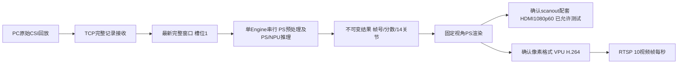

# 首版全流程接入计划（2026-10-07）

最新授权更新：用户已完成H264样片审查，允许HDMI测试，解除下述暂停。按[NEXT-VIDEO-PLAN](NEXT-VIDEO-PLAN-20261007.md)先真实骨架文件与HDMI配套核对，再1080p60实屏/RTSP/真实推理合并；硬件配套核验要求保持，未新板测或更换BOOT。

最新用户调整：HDMI目标替代原720p60为1920×1080@60Hz；DELL E2421HN已接入并报告时序不支持，HDMI设备测试明确暂停，未切换板端时序/BOOT/位流。独立VPU720p10fps/30帧H264文件与主机审查已完成，[结果](VPU-RESULTS-20261007.md)。下一步有界编码接口/真实预生成画面/时间戳与色彩信号/独立RTSP；此文件此前未编码/未接屏文字作为历史。

实施更新：E1-C CPU渲染、27图与三帧网络绘图已通过，[结果](RENDER-RESULTS-20261007.md)；V0当前只确认多平面格式/尺寸枚举，[配套表](V0-VIDEO-PAIRING-20261007.md)明确未实际编码、HDMI时序仍未知且屏幕未连。下一阶段按独立输出门检继续，旧尚未渲染的规划文字为历史。

实施更新：用户已批准本计划，首批E1-A/B已完成实板核验，见[结果](APPLICATION-RESULTS-20261007.md)与[新恢复点](evidence/application-20261007-r2/next-checkpoint.json)。下一阶段为E1-C/V0；以下“本次仅规划/尚未执行”保留为最初方案形成时的历史状态。

本轮完成方案归档与规划，不创建新应用、不编译/连接板端、不初始化视频或替换BOOT。用户已确认当前异构方案作为首版基线；[ADR_01](../../ADR/ADR_01.md)记录此决策，深度性能优化后置。下面为待实施阶段及具体门检建议。

## 当前位置与优先级

模型计算主链和固定样本数值阶段已完成，lazy-r4短期核心5.24655Hz；系统还缺生产调用接口、板端TCP接收、渲染、HDMI/VPU/RTSP及长期闭环。
全项目回放首版管理估算保持69/100（约65%–70%）；本次写方案不增加功能完成份额。实时采集终版和2026训练旁支单列。

首要工作是E1-A生产接口及E1-B网络回放。视频配套与关节语义资料核对可同时准备，不运行相机示例或猜测寄存器。N2候选身份诊断非阻断；暂缓裸指针/零拷贝、计算图重编与新算子内核。

## 建议应用结构

接收工作者可以继续组包，推理仍只有一个Engine且不允许并发forward。候选方案是一个待处理完整窗口槽位：处理忙时新完整窗口替换尚未开始的旧窗口并计数，不替换正在处理的数据、不截断TCP字节流。收到非法头部无法可靠定位边界时关闭当前连接，不在负载中猜测magic重同步。

结果帧使用不可变值及明确所有权交给渲染/输出；显示与编码分别持有转换后缓冲区，缓冲区轮转须确认消费者完成。首版允许拷贝，不要求两个设备共用同一物理缓冲区。接收、绘图与编码线程是否可重叠及其CPU/DDR竞争须实测，不预设能消除约9.4ms平均核心预算余量的约束。

## 分阶段实现与门检

| 阶段 | 具体实现/产物 | 通过标准与停止条件 |
| --- | --- | --- |
| E1-A 生产接口 | 新隔离应用目标，复用lazy-r4数学/注册/桥/同步；`process_window(Window)`返回100分数、100×14×3姿态及选择结果/帧号/本机耗时；固定Tokens参考核对留测试包装器 | Host107含异常保持；先原三帧＋重复全输出逐位r6，再核对生产/验证入口同窗口同结果；无参考调用仍执行结构/有限性/身份/完成检查，异常永久停止Engine |
| E1-B TCP回放 | 板端接收既有协议、端口默认39001、完整记录组包、长度/有限性/连接会话检查及有界槽位；复用现有PC发送端 | 先主机碎片/粘包/短读/中断/非法记录单元检查，再固定三帧无丢帧网络对照；扩展27样本比较既有板端输出，帧号/接收/执行/丢弃数量可核对；非法输入不进入Engine |
| E1-C 骨架画面 | 确认24版标签连线/坐标轴，以冻结渲染配置做固定视角；显示帧号、分数、状态；合成画面及实际最高分姿态帧缓存 | 输出原坐标不改，投影/显示缩放单独记录；人工确认连线/轴向与合成图，未确认不标解剖名称或米；无GT/平滑/人物匹配；先导出PS图像确认，再对接设备 |
| V0 视频配套 | 核对当前25122301 BOOT/位流/设备树、1080p60像素时钟/消隐、HDMI寄存器及缓冲区、VPU格式/stride/planes、驱动/live555配套 | VPU两端协商及有限文件编码已通过；HDMI目标调整不作实际时钟证明，暂停期间不配置；region/MMU/寄存器配套不明停止，需变更启动组件另提方案 |
| V1 HDMI独立（用户已允许） | 在确认的路径输出静态色条、帧号/换帧图，目标1920×1080@60Hz | 已接DELL E2421HN但当前时序不支持；仍需实屏分辨率、色彩/stride、稳定刷新和缓冲区轮转证据；不初始化NPU来代替测试 |
| V2 编码与RTSP独立 | PS合成720p画面→确认的VPU输入格式→H.264→live555；视频目标10fps | 核对SPS/PPS/NAL长度与所有权，不沿用参考固定24/8字节假设；PC播放器可解码、重连、显示正确帧号；格式/超时/错误停止并保存 |
| F0 真实双路合并 | 同一板端推理结果绘制画面分别送HDMI/VPU；有界画面队列、过期和断流状态 | 帧号可追溯到接收与本次推理；HDMI60Hz/编码10fps/有效骨架更新分别计数，重复画面不计新推理；设备竞争不破坏r6帧协议 |
| F1 整机与长期验收 | 固定回放/超载/输入断流/重连/错误记录、全链本机计量及30分钟连续运行 | 有效骨架≥5Hz、板端完整窗口到达至画面完成P95≤500ms，内存/队列不持续增长；PC播放延迟另测；保存模型/源码/BOOT身份、耗时/丢帧/错误及双路实测 |

具体实施时每阶段使用新包/构建/板端目录，上一阶段输出回传核对后进入下一阶段；已验收旧包不重跑、不改名作新门禁。板端设备访问显式授权与身份检查沿用。超时、OOM、SDK/总线异常、非有限输出或身份变化停止，保留全部部分证据，不自动复位/重试/改BOOT。

E1-A接口修改将移除生产调用对冻结参考的依赖，不移除参考测试或合法性检查；证据API应与返回数值结构解耦，不把每帧完整磁盘捕获放入生产关键路径。性能计量采用可界定的有限采样批次，长期状态用有界统计或批量写出，避免现有验证流字符串/计时向量随30分钟输入无限增长。

## 协议与资源预算

沿用[PROTOCOL.md](../../software/pose_v1/PROTOCOL.md)：32字节头＋86,400字节little-endian FP64 I/Q，合计86,432字节，magic/版本/长度/帧号/发送端时间戳均按现有定义；不新增不兼容ACK或修改序列化。
5个窗口/秒的应用记录量为432,160字节/秒，10个为864,320字节/秒，不含TCP/以太网开销；这只是带宽估算，不能替代碎片组包和实际网络联调。

连接内帧号应单调，重连作为新会话记录并清空未处理窗口，不把旧会话残留发给新会话；网络正常中断与Engine异常区分，后者不在同进程自动重建Session。具体空闲超时、队列统计和重连策略在E1-B实现配置中固定并测异常路径。

| 计量点 | 定义 |
| --- | --- |
| 完整窗口到达 | 当前记录最后一个字节收到并能组出完整窗口的板端steady_clock时间；非法记录另计拒绝 |
| 推理进入/完成 | 排队后单Engine处理开始及两个输出最终就绪/计数确认之后；分列队列/预处理/forward/结果检查 |
| 渲染完成 | PS实际画面及必要格式转换完成，记录源frame_id与本机时间 |
| HDMI交接/呈现 | 提交与实际换帧完成分列；若只能测提交则不得称实屏呈现延迟已通过 |
| VPU/RTSP | 编码输入/输出和RTSP提交分别计量；重复画面标明源frame_id |
| PC呈现 | 通过帧号关联与独立同步/观察方法测量，不直接减未经同步的PC发送与板端时间戳 |

在30次核心样本中全帧低于200ms不代表30分钟都如此。网络/绘图/编码可重叠时应看关键路径、各工作者服务速率及争用，不能把异步跨度直接相加或宣称无需预算。若全链吞吐未达标，先记录瓶颈并讨论最小修正，深度零拷贝/图/算子优化仍按ADR_01后置。

## 第一批交付及后续决策

下一实施批次建议仅E1-A＋E1-B：交付隔离生产核心/接收程序、PC固定回放命令、离线与网络异常测试、构建身份及三/27帧板端对照报告。保持旧检查器和所有校验，不新装依赖，不初始化HDMI/VPU或启用服务自动启动。

同时形成V0配套问题清单和14关节展示配置的可审阅选择，之后开展E1-C及独立视频门检。需要用户现场屏幕/播放观察的步骤在进入对应门检时集中安排，不以不可见的画面成功作为验收。

本次确认的是首版路线与规划；未执行上述新阶段。既有P2恢复点保留，新文档作为下一次实施入口，后续每阶段完成才更新Done与管理份额。
